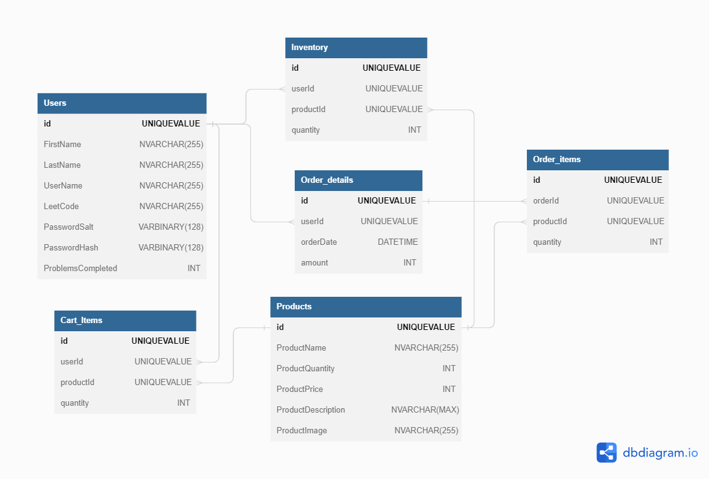

# Project Overview
   - The currency is hydrogen and you can buy new elements (fusion). You can earn more hydrogen by completing Leetcode problems.
   
# Scrum Management
   - [Documentation](https://www.atlassian.com/agile/scrum/roles)
   - Scrum Master: Jacob
      - Help product owner define value
         - Plan sprints
      - Help development team deliver value and improve
         - Manage blockers
   - Development team
      - James
      - Duncan
      - Gregory
      - Chi

# MVP Goals
   - User goals
      - As a User Guest, I should be able to see and purchase products (elements) that are usually unavailable during a sale (supernova) 
      - As a User or Guest, I should be able to select an amount of a product (element) to add to my cart (fusion reactor)
      - As a User or Guest, I should be able to see a product’s (element) description
      - As a User or Guest, I should be able to remove items (elements) from my cart within the Cart View.
   - Application should be accessible from the cloud
   - Trigger a supernova sale by creating a specific amount of iron (like a supernova in nature) 
   - Application should have CI/CD pipeline for frontend and backend that:
      - Runs existing tests
      - Build the application
      - Deploy the application
   - Dockerize backend

# Stretch Goals
   - As a User Guest or Admin, I should be able to change the color scheme from the normal mode to a dark mode option.
   - As a User, I should be able to view a list of all my previous orders and access the details of each order.
   - As a User, I should be able to save items to a wish list to buy later.
      - As a User, I should receive notifications whenever an item in my wish list is put on sale.
   - ASP.NET Core SignalR
   - As a user, I should be informed with a Notification when I have enough Hydrogen to buy certain elements. eg. If (H >= 6) {alert(“You have enough Hydrogen to fuse into Carbon”)}

# ERD

# External API
   - Wikipedia API to get snippets about elements
   - Leetcode API for currency
